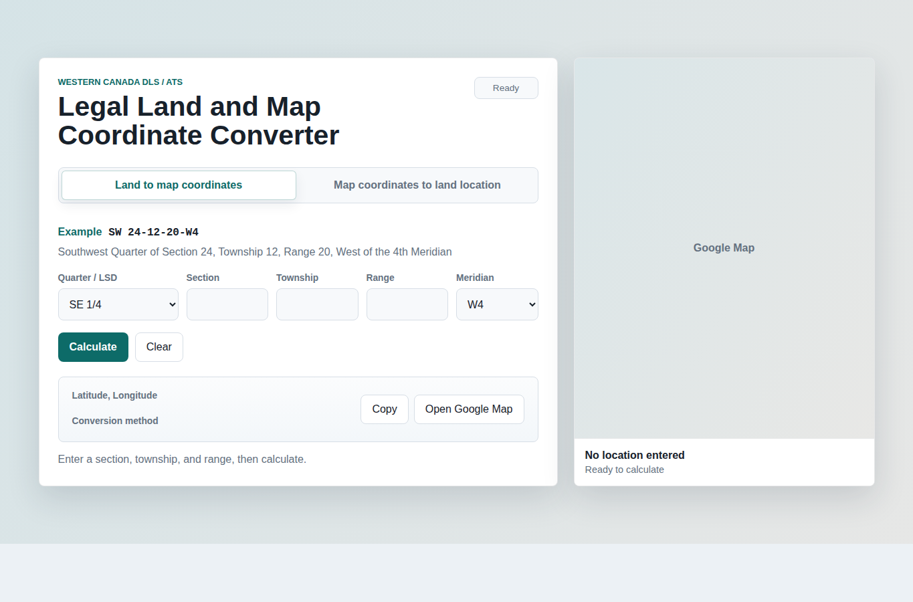
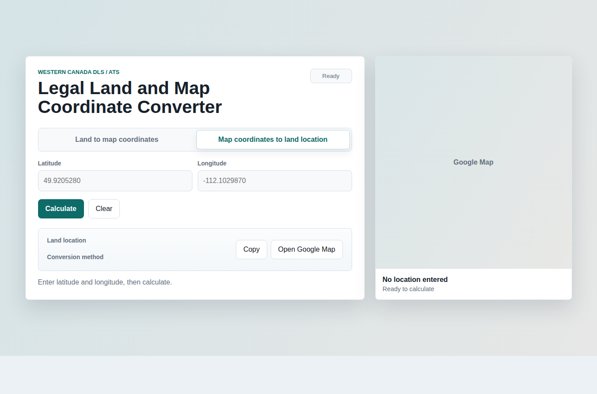

# Legal Land and Map Coordinate Converter

A web app for converting Western Canadian legal land descriptions to latitude/longitude coordinates, and for estimating a legal land location from map coordinates.

Live app: https://legal-land-convertor.netlify.app/

## Screenshots

Land to map coordinates mode lets you enter Quarter/LSD, Section, Township, Range, and Meridian. It returns coordinates, the method used, and a Google Maps satellite preview.



Map coordinates to land location mode lets you enter latitude and longitude. It returns a compact land description for copying, with the detailed wording underneath.



## Features

- Convert legal land inputs such as `SW 24-12-20-W4` into latitude/longitude.
- Convert latitude/longitude back into a compact land location such as `SW 24-12-20-W4`.
- Show the conversion method for every result:
  - Direct lookup from Alberta ATS parcel fabric
  - Fallback to federal DLS township grid estimate
  - Fallback to local DLS math
- Copy the main output with one button.
- Open the result in Google Maps.
- Show an embedded Google Maps satellite preview.
- Keep the map preview height aligned with the converter panel.

## Data Sources

The app uses public ArcGIS services directly from the browser:

- Alberta ATS parcel fabric:
  `https://services7.arcgis.com/hFo7GO2CrHDM1QVm/ArcGIS/rest/services/ATS/FeatureServer/0`
- Federal Dominion Land Survey township grid:
  `https://geo.sac-isc.gc.ca/geomatics/rest/services/ATRIS_PRD/DOMINION_LAND_SURVEY_E/MapServer/2`

For Alberta, the app can perform a direct parcel lookup. For other areas, or when a direct match is unavailable, it falls back to township-grid or local DLS math estimates.

## Requirements

- A modern browser.
- Internet access for ArcGIS lookups and Google Maps previews.
- Optional: Python 3.8+ to run a local static file server.

No npm install step is required.

## Launch

Clone the repository on Ubuntu:

```bash
git clone git@github.com:saad-git-007/legal-land-converter.git
cd legal-land-converter
```

Check that Python is available for the local static server:

```bash
python3 --version
```

Start the app on port `8000`:

```bash
python3 -m http.server 8000
```

Open the app in your browser:

```text
http://127.0.0.1:8000
```

Or from the Ubuntu terminal:

```bash
xdg-open http://127.0.0.1:8000
```

Open a specific tab directly in the browser:

```text
http://127.0.0.1:8000/?mode=land
http://127.0.0.1:8000/?mode=coordinates
```

If port `8000` is already in use, run it on another port:

```bash
python3 -m http.server 8080
```

Then open:

```text
http://127.0.0.1:8080
```

Stop the local server with `Ctrl+C` in the terminal where it is running.

You can also open `index.html` directly in a browser, but using a local server is recommended.

## Files

- `index.html` - app markup
- `styles.css` - layout and visual styling
- `app.js` - conversion logic, GIS lookups, map updates
- `requirements.txt` - dependency note for GitHub
- `screenshots/` - README screenshots

## Accuracy Notes

Direct Alberta ATS parcel lookup is the most accurate path currently used by the app. Federal township-grid fallback and local DLS math are estimates because real surveyed sections, correction lines, road allowances, and parcel fabric irregularities can shift positions.

For survey-grade accuracy, use official parcel fabric or surveyed coordinates from the relevant provincial authority.
